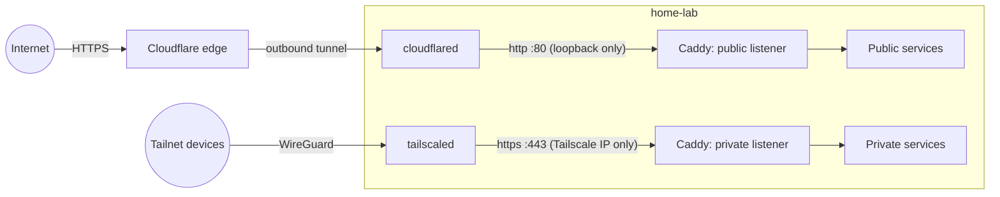

# Homelab

Documentation for my self-hosted homelab: what runs, how traffic reaches it,
and why it is built this way.

> This repository is public and contains **documentation only**. Deployment
> configuration, secrets and environment files live in a separate private
> repository on the host.

## At a glance

| | |
|---|---|
| Host | `home-lab`, HP ProDesk 400 G6 SFF (i5-9400, 6 cores, 22 GB RAM, 256 GB SSD) |
| OS | Ubuntu 26.04 LTS |
| Runtime | Docker CE + Docker Compose, one Compose project per service |
| Reverse proxy | Caddy |
| Public ingress | Cloudflare Tunnel (no open ports on the home router) |
| Private access | Tailscale |
| Domain | `ashiqabdulkhader.dev` (DNS on Cloudflare) |

## Access model

Every service sits in one of two tiers. **Private is the default**; a
service is published to the internet only on purpose.

| Tier | Who can reach it | Hostname pattern | Path |
|---|---|---|---|
| **Private** | Devices on my tailnet | `<app>.lab.ashiqabdulkhader.dev` | Tailscale → Caddy (HTTPS) → container |
| **Public** | Anyone on the internet | `homelab-<app>.ashiqabdulkhader.dev` | Cloudflare → Tunnel → Caddy → container |

See [docs/architecture.md](docs/architecture.md) for the full picture.

## Documentation

- [Architecture](docs/architecture.md): host, containers, request paths
- [Networking](docs/networking.md): Cloudflare Tunnel, Tailscale, DNS and TLS
- [Services](docs/services.md): what runs, and in which tier
- [Operations](docs/operations.md): adding, exposing, updating services
- [Decisions](docs/decisions.md): why things are the way they are

## Status

| Component | State |
|---|---|
| Docker CE, Compose layout | Done |
| Caddy + Cloudflare Tunnel (public tier) | Done |
| Private tier (Tailscale-only `*.lab`) | Done |
| Access control on public apps (Cloudflare Access) | Planned |
| Backups | Planned |
| Monitoring | Planned |
