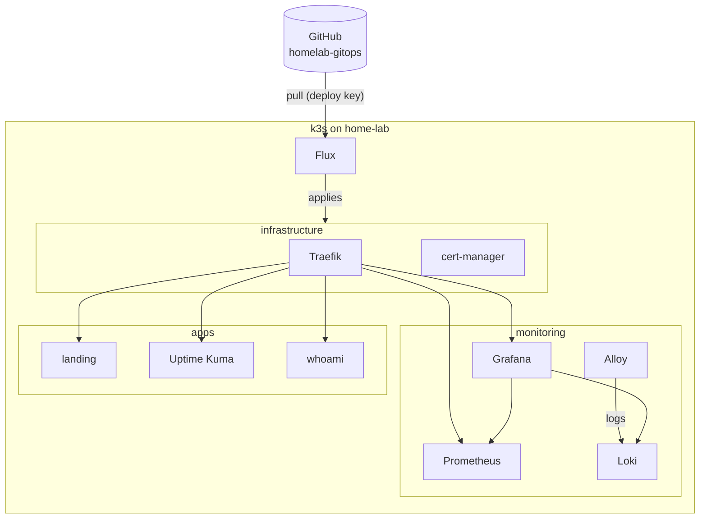
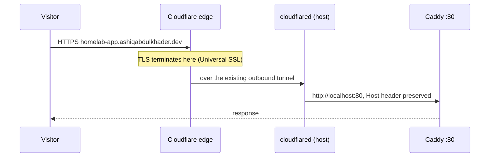
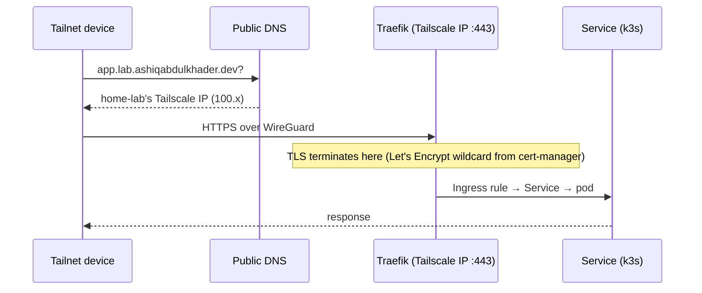

# Architecture

## Host

A single small-form-factor PC runs everything.

| | |
|---|---|
| Machine | HP ProDesk 400 G6 SFF |
| CPU | Intel Core i5-9400 (6 cores) |
| Memory | 22 GB |
| Storage | 256 GB SATA SSD |
| OS | Ubuntu 26.04 LTS |

### Host-level services

These run directly on the OS under systemd:

| Service | Purpose |
|---|---|
| `k3s` | Single-node Kubernetes. Runs every private app |
| `docker` / `containerd` | Docker CE, now only for the public-tier Caddy |
| `cloudflared` | Cloudflare Tunnel connector. Makes outbound connections only |
| `tailscaled` | Tailscale node. Private access and SSH (Tailscale SSH) |
| `homelab-backup` (timer) | Nightly restic backup to Cloudflare R2 |
| `homelab-firewall` | nftables guard keeping k3s internals off the LAN |

## Two layers of configuration

| Repository | Visibility | Holds | Applied by |
|---|---|---|---|
| `homelab-gitops` | Private | Everything inside k3s: ingress, certificates, monitoring, apps, encrypted secrets | Flux, continuously |
| `homelab-config` | Private | Everything outside k3s: public-tier Caddy, backup scripts and timers, host firewall, install and bootstrap scripts | Me, by hand |
| `Homelab` (this) | Public | Documentation only | — |

## Kubernetes (k3s)

k3s runs as a single server node. Its bundled Traefik and ServiceLB are
disabled; Flux installs Traefik itself so that it is configured in git.

| Layer | Contents | Notes |
|---|---|---|
| infrastructure | Traefik, cert-manager, ClusterIssuer, `*.lab` wildcard certificate | Applied first; everything else waits for it |
| monitoring | kube-prometheus-stack (Prometheus, Grafana, node-exporter, kube-state-metrics), Loki, Alloy | See [Monitoring](monitoring.md) |
| apps | One namespace per app, each with a Deployment, Service and Ingress | See [Services](services.md) |

- **Storage:** k3s's `local-path` provisioner, under `/srv/k3s/storage`
  on the host. Included in backups, except Prometheus and Loki data.
- **Secrets:** committed to git encrypted with SOPS (age). Flux decrypts
  them in the cluster. The age key is backed up and kept in a password
  manager.
- **Changes:** a commit to `homelab-gitops`. Nothing is `kubectl apply`'d
  by hand.

## Public tier (Docker)

The public tier still runs on Docker: one stock `caddy:2` container, published only
on `127.0.0.1:80`, which `cloudflared` reaches. It serves the public
landing page. No private service is reachable through it.

## Ports on the host

| Host address | Owner | Used by | Tier |
|---|---|---|---|
| `127.0.0.1:80` | Caddy (Docker) | `cloudflared` | Public |
| Tailscale IP `:443` | Traefik (k3s hostPort) | Tailnet clients | Private |

Neither is reachable from the home LAN or the internet directly.

## Request paths

### Public: internet to service

- The home router has **no port forwards**; `cloudflared` dials out to
  Cloudflare.
- The tunnel has one catch-all rule that sends everything to Caddy. Caddy
  decides by hostname, and unknown hostnames get a 404.

### Private: tailnet to service

- The DNS record is public but points at a Tailscale (CGNAT `100.64.0.0/10`)
  address, which only tailnet members can route to.
- Traefik's host port is bound only to the Tailscale IP, and the tunnel
  has no path to it. A private app cannot be reached through Cloudflare,
  even if a DNS record were misconfigured.

## Security boundaries

| Boundary | Control |
|---|---|
| Internet → host | No inbound ports. Only the Cloudflare Tunnel (outbound) |
| LAN → services | Ingress listens on loopback (public) and the Tailscale IP (private) only |
| LAN → k3s internals | nftables guard drops the k3s API, kubelet, node-exporter and VXLAN unless from loopback, tailnet or pods |
| Public ↔ private tier | Separate proxies. The tunnel reaches only Caddy on loopback |
| Tailnet → host | Tailscale identity and ACLs; SSH through Tailscale SSH |
| Git → cluster | Flux pulls with a read-only deploy key; the cluster is never pushed to |
| Secrets | SOPS-encrypted in git (cluster); per-stack `.env` files on the host (Docker) |
| Backups | Encrypted on the host by restic before upload; bucket is private and the key is limited to that bucket |

### Host firewall

k3s binds some ports on every interface. A small nftables table
(`homelab_guard`, loaded by `homelab-firewall.service`) drops them unless
the traffic comes from loopback, `tailscale0`, or the pod network:

| Port | Service | Why it matters |
|---|---|---|
| 6443/tcp | k3s API | Authenticated, but no reason to expose it to the LAN |
| 10250/tcp | kubelet | Authenticated, same |
| 9100/tcp | node-exporter | No authentication: host metrics |
| 8472/udp | flannel VXLAN | No authentication: could inject packets into the pod network |

The table only drops; it never accepts on behalf of other rules, so Docker
and k3s keep managing their own iptables/nftables chains. kubectl still
works from tailnet devices.
