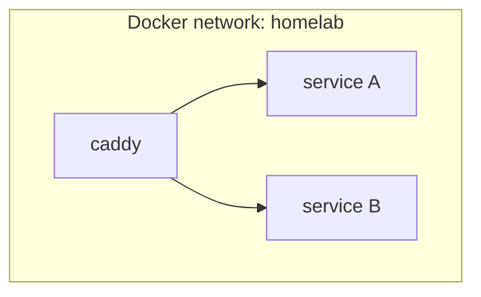
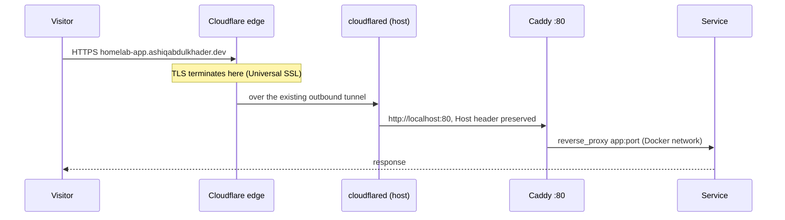
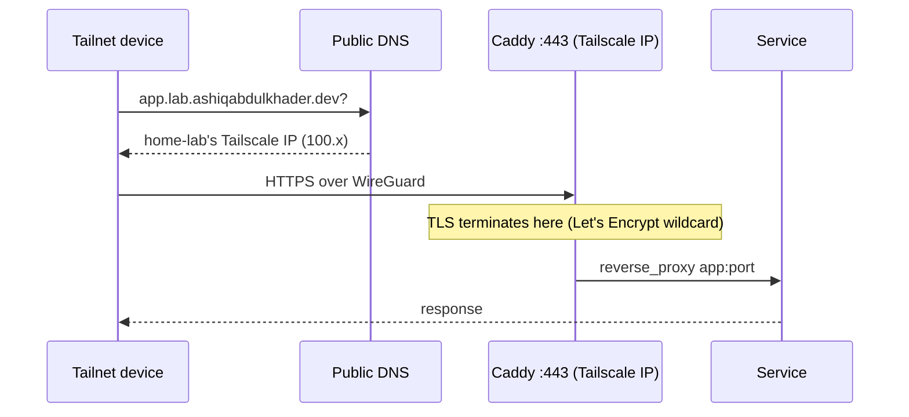

# Architecture

## Host

A single small-form-factor PC runs everything.

| | |
|---|---|
| Machine | HP ProDesk 400 G6 SFF |
| CPU | Intel Core i5-9400 (6 cores) |
| Memory | 22 GB |
| Storage | 256 GB SATA SSD |
| OS | Ubuntu 26.04 LTS |

### Host-level services

These run directly on the OS under systemd, not in containers:

| Service | Purpose |
|---|---|
| `docker` / `containerd` | Container runtime (Docker CE from Docker's apt repository) |
| `cloudflared` | Cloudflare Tunnel connector. Makes outbound connections only |
| `tailscaled` | Tailscale node. Private access and SSH (Tailscale SSH) |

## Container layout

Each service is its own Docker Compose project. All projects join a shared
external bridge network called `homelab`, so Caddy can reach any service by
container name without publishing the service's ports on the host.



Only Caddy publishes ports on the host, and only on two specific addresses:

| Host address | Container port | Used by | Tier |
|---|---|---|---|
| `127.0.0.1:80` | 80 (plain HTTP) | `cloudflared` | Public |
| Tailscale IP `:443` | 443 (HTTPS) | Tailnet clients | Private |

Neither address is reachable from the home LAN or the internet directly.

### Private configuration repository

The deployable configuration lives in a private git repository on the host:

```
homelab-config/
├── stacks/          one directory per Compose project
│   ├── _template/   starting point for new services
│   ├── caddy/       reverse proxy: compose.yml, Caddyfile
│   └── <service>/
├── data/            persistent volumes, data/<service>/ (not in git)
├── backups/         backup output (not in git)
└── scripts/         helpers to scaffold, start and stop stacks and to publish DNS
```

Secrets live in per-stack `.env` files that are never committed.

## Request paths

### Public: internet to service



- The home router has **no port forwards**; `cloudflared` dials out to
  Cloudflare.
- The tunnel has one catch-all rule that sends everything to Caddy. Caddy
  decides by hostname, and unknown hostnames get a 404.
- Caddy recovers the visitor's real IP from the `Cf-Connecting-Ip` header.

### Private: tailnet to service



- The DNS record is public but points at a Tailscale (CGNAT `100.64.0.0/10`)
  address, which only tailnet members can route to.
- Caddy's private listener is bound only to the Tailscale interface, and the
  tunnel has no path to it. A private app therefore cannot be reached through
  Cloudflare, even if a DNS record were misconfigured.

## Security boundaries

| Boundary | Control |
|---|---|
| Internet → host | No inbound ports. Only the Cloudflare Tunnel (outbound) |
| LAN → services | Caddy listens on loopback and the Tailscale IP only |
| Public ↔ private tier | Separate Caddy listeners. The tunnel reaches only the public one |
| Tailnet → host | Tailscale identity and ACLs; SSH through Tailscale SSH |
| Secrets | Per-stack `.env` files on the host, outside git |
| Backups | Encrypted on the host by restic before upload; bucket is private and the key is limited to that bucket |
