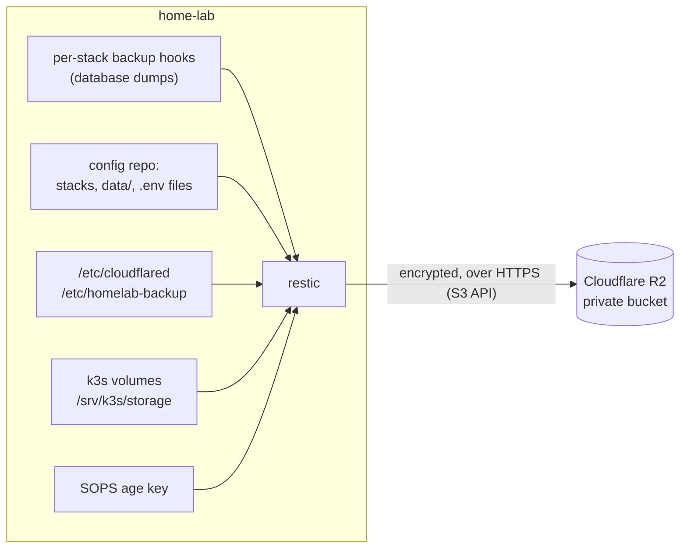

# Backups

## Summary

| | |
|---|---|
| Tool | [restic](https://restic.net): encrypted, deduplicated, compressed snapshots |
| Destination | Cloudflare R2 bucket in the Asia-Pacific region, private, Standard storage class |
| Schedule | Nightly at 03:30 (±15 min), systemd timer, catches up after downtime |
| Verification | Weekly `restic check`, reading back a random 5% of the data |
| Alerting | Both jobs send a heartbeat to Uptime Kuma; a failure or a missed run alerts on Telegram |
| Retention | 7 daily, 4 weekly, 6 monthly |
| Runs as | root, because containers write their data directories as root |



## What is backed up

| Path | Why |
|---|---|
| Config repository, including `data/` | All service state: volumes, Caddy certificates and ACME account |
| Per-stack `.env` files | Secrets that are deliberately not in git |
| `/etc/cloudflared` | Tunnel credential, so the tunnel can be restored without re-creating it |
| `/etc/homelab-backup` | Backup configuration (R2 credentials and restic password) |
| `/srv/k3s/storage` | k3s persistent volumes (for example Uptime Kuma's database) |
| `~/.config/sops/age` | The age key that decrypts the secrets in `homelab-gitops` |

Excluded: caches, temporary files, `node_modules`, and k3s volumes in the
`monitoring` namespace (Prometheus and Loki data: large, constantly
changing, and rebuilt empty on restore).

Not backed up, because git is the source of truth: the cluster itself.
Rebuilding means installing k3s and running `flux bootstrap` again.

### Consistent database backups

Copying a live database's files can capture a half-written state. A stack
that runs a database provides an executable `backup-hook.sh`, which writes a
dump (for example `pg_dump`) into its data directory. All hooks run before
each snapshot.

## Security

- Data is encrypted on the host before upload. Cloudflare only stores
  ciphertext.
- The R2 key can only read and write objects in this one bucket. It cannot
  touch DNS, the tunnel, or other buckets.
- The bucket has public access disabled and no custom domain.
- Credentials live in a root-only directory on the host.
- **The restic password and the SOPS age key are kept in a password manager
  off the host.** Without the first, the backups are unreadable; without the
  second, the cluster's secrets in git are.

## Restore

From the host (or a replacement machine with restic and the credentials):

```bash
# list snapshots
sudo sh -c 'set -a; . /etc/homelab-backup/env; restic snapshots'

# restore one service's data to a scratch directory, inspect, then move into place
sudo sh -c 'set -a; . /etc/homelab-backup/env; restic restore latest --target /tmp/restore --include <path-to>/data/<app>'
```

### Full rebuild on new hardware

1. Install Ubuntu, Tailscale and Docker CE.
2. Install restic. Recreate `/etc/homelab-backup/env` from the password
   manager and R2 (or create a new bucket-scoped key).
3. `restic restore latest --target /` to bring back the config repository,
   `data/`, `.env` files and `/etc/cloudflared`.
4. Reinstall the `cloudflared` service and start the Caddy stack.
5. Install k3s (`scripts/install-k3s.sh`), then run `flux bootstrap` (as in
   `scripts/cutover-k3s.sh`, after creating the `sops-age` secret from the
   restored age key). Flux rebuilds every private app from git; PVC data
   comes back from `/srv/k3s/storage`.
6. If the Tailscale IP changed, update it in Traefik's HelmRelease and in
   the `*.lab` DNS record.

## Cost

R2's free tier covers 10 GB-month of Standard storage and has no egress
fees, so restores are free. The homelab currently uses well under 1 MB.
