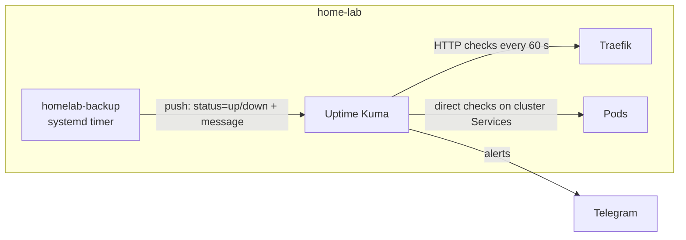

# Monitoring

## Summary

| | |
|---|---|
| Uptime and alerts | [Uptime Kuma](https://github.com/louislam/uptime-kuma) 2 at `kuma.lab.ashiqabdulkhader.dev`, Telegram on every monitor |
| Metrics | Prometheus (15 days, 8 GB cap) at `prometheus.lab.ashiqabdulkhader.dev` |
| Logs | Loki (14 days), collected by Grafana Alloy |
| Dashboards | Grafana at `grafana.lab.ashiqabdulkhader.dev` |
| Where | All in k3s, private tier only, declared in `homelab-gitops` |

## Monitors

| Monitor | Type | What it catches |
|---|---|---|
| Public landing page | HTTP(S), 60 s | Tunnel, Cloudflare or Caddy public listener down |
| Private landing page | HTTP(S), 60 s, certificate expiry alert | Traefik down; **wildcard certificate renewal failing** |
| whoami (direct) | HTTP, 60 s (`whoami.whoami.svc.cluster.local`) | Cluster networking between pods |
| Backup | Push, expects one every 25 h | Nightly backup failed (`down` with exit code and line), or did not run at all |
| Backup check | Push, expects one every 8 days | Weekly integrity check failed or did not run |

### Two kinds of check

- **Pull (HTTP):** Kuma runs in the cluster, so it can check a service
  directly (`http://<svc>.<ns>.svc.cluster.local`) or through the full path
  via DNS and Traefik. Checking both separates "the app is down" from "routing is
  broken".
- **Push (heartbeat):** scheduled jobs report to Kuma when they finish.
  Kuma alerts on an explicit `down`, and also when a heartbeat is
  **missing**, which catches jobs that never started (timer disabled, host
  asleep, credentials expired).

### Why a certificate expiry alert on the private tier

Public certificates are issued and renewed by Cloudflare. The private
`*.lab` wildcard is renewed by cert-manager through the Cloudflare DNS API, so a
revoked or expired API token would quietly break renewal. The expiry alert
gives weeks of warning before browsers start to fail.

## Metrics and logs

| Source | Collected by | Where to look |
|---|---|---|
| Host CPU, memory, disk, network | node-exporter → Prometheus | Grafana: *Node Exporter / Nodes* |
| Pods, deployments, PVCs | kube-state-metrics, kubelet → Prometheus | Grafana: *Kubernetes / Compute Resources* |
| Pod logs | Alloy → Loki | Grafana Explore, Loki: `{namespace="<ns>"}` |
| Host journal (cloudflared, tailscaled, k3s, backups) | Alloy → Loki | Grafana Explore, Loki: `{job="systemd-journal", unit="homelab-backup.service"}` |

Prometheus picks up `ServiceMonitor`, `PodMonitor` and `PrometheusRule`
objects from every namespace. Grafana loads dashboards from ConfigMaps
labelled `grafana_dashboard: "1"` in any namespace, so an app can ship its
own dashboard. Grafana has no persistent volume: dashboards and data
sources come from git.

Alertmanager is not deployed yet. Uptime Kuma remains the alerting path.

## Adding a service

Every new service gets at least one HTTP monitor with the Telegram
notification. Any new scheduled job sends a push heartbeat.

## Limits

Kuma runs on the same host it monitors. If the whole machine or its
internet connection goes down, nothing raises the alarm. An external check
on the public landing page (from a free hosted monitor) would cover that.
