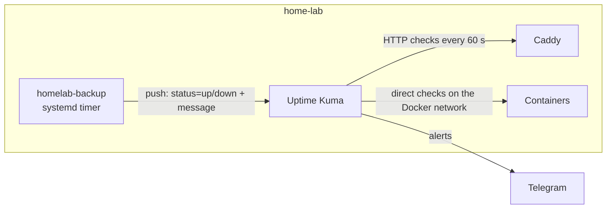

# Monitoring

## Summary

| | |
|---|---|
| Tool | [Uptime Kuma](https://github.com/louislam/uptime-kuma) 2 (slim image, SQLite) |
| Where | Private tier: `kuma.lab.ashiqabdulkhader.dev`, reachable only on the tailnet |
| Alerts | Telegram, attached to every monitor |

## Monitors

| Monitor | Type | What it catches |
|---|---|---|
| Public landing page | HTTP(S), 60 s | Tunnel, Cloudflare or Caddy public listener down |
| Private landing page | HTTP(S), 60 s, certificate expiry alert | Caddy private listener down; **wildcard certificate renewal failing** |
| whoami (direct) | HTTP, 60 s | Docker networking between containers |
| Backup | Push, expects one every 25 h | Nightly backup failed (`down` with exit code and line), or did not run at all |
| Backup check | Push, expects one every 8 days | Weekly integrity check failed or did not run |

### Two kinds of check

- **Pull (HTTP):** Kuma sits on the shared Docker network, so it can check a
  service directly (`http://<container>:<port>`) or through the full path via
  Caddy and DNS. Checking both separates "the app is down" from "routing is
  broken".
- **Push (heartbeat):** scheduled jobs report to Kuma when they finish.
  Kuma alerts on an explicit `down`, and also when a heartbeat is
  **missing**, which catches jobs that never started (timer disabled, host
  asleep, credentials expired).

### Why a certificate expiry alert on the private tier

Public certificates are issued and renewed by Cloudflare. The private
`*.lab` wildcard is renewed by Caddy through the Cloudflare DNS API, so a
revoked or expired API token would quietly break renewal. The expiry alert
gives weeks of warning before browsers start to fail.

## Adding a service

Every new service gets at least one HTTP monitor with the Telegram
notification. Any new scheduled job sends a push heartbeat.

## Limits

Kuma runs on the same host it monitors. If the whole machine or its
internet connection goes down, nothing raises the alarm. An external check
on the public landing page (from a free hosted monitor) would cover that.
